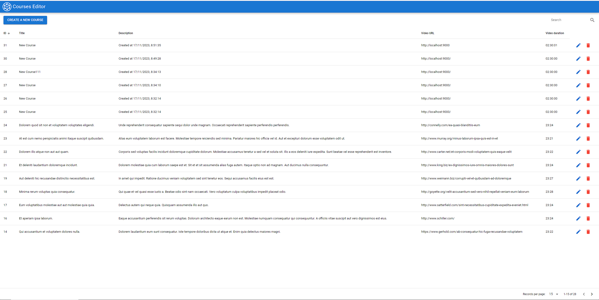

# Courses Editor (courses-frontend)

CRUD for the courses-backend!

It features a Vue 3 (Quasar 2) Q-Table, with simple fields validation, CRUD, notifications, and API handling.

And some simple E2E testing.



## E2E Testing

Cypress is used for E2E testing.
On Ubuntu, you will need the following to use Cypress:

`sudo apt-get install xvfb libgtk2.0-0 libnotify-dev libgconf-2-4 libnss3 libxss1 libasound2`

Now, you should start the app on debug mode by running:

`quasar dev`

And then:

`npx cypress open`

Which will run the e2e test suite from `cypress/e2e/courses-frontend-spec.cy.js`.

Mind you, this will run the tests on localhost:9000

It will check that:

- The page loads
- The table renders
- The modal opens, gets filled with data, and saved without errors.

## Install the dependencies

```bash
yarn
# or
npm install
```

### Start the app in development mode (hot-code reloading, error reporting, etc.)

```bash
quasar dev
```

### Lint the files

```bash
yarn lint
# or
npm run lint
```

### Format the files

```bash
yarn format
# or
npm run format
```

### Build the app for production

```bash
quasar build
```

### Customize the configuration

See [Configuring quasar.config.js](https://v2.quasar.dev/quasar-cli-vite/quasar-config-js).
